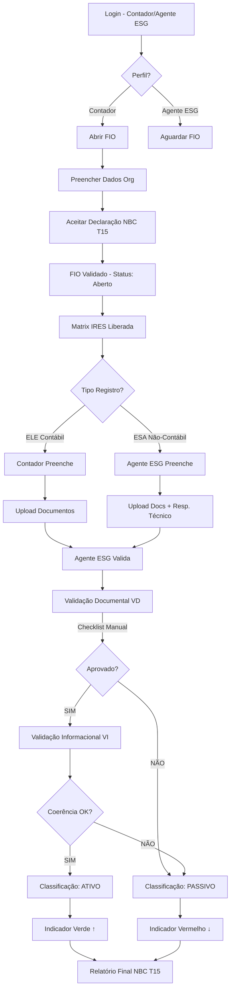

# 🎯 BSI-BSAM MVP - MANUAL TÉCNICO COMPLETO
## Arquitetura 100% Readdy.AI (React 19 + Supabase)

---

## 📋 ÍNDICE

1. [Visão Geral do Sistema](#visao-geral)
2. [Fluxo de Funcionamento](#fluxo)
3. [Camadas do Sistema](#camadas)
4. [Validação Manual Assistida](#validacao)
5. [Classificação Automática](#classificacao)
6. [Geração de Relatórios](#relatorios)
7. [Segurança e Auditoria](#seguranca)

---

## 🏗️ VISÃO GERAL DO SISTEMA <a name="visao-geral"></a>

### **Premissa do MVP:**
Transformar processos "automáticos" em **"manual assistido"** onde:
- ❌ Não remove funcionalidades
- ✅ Adiciona assistência inteligente
- ✅ Valida manualmente com checklists
- ✅ Classifica automaticamente resultados

### **Stack Tecnológica:**
```
Frontend:  React 19 + TypeScript + TailwindCSS
Backend:   Supabase (PostgreSQL + Auth + Storage)
Validação: Manual assistida por checklists
Cálculos:  Client-side + SQL Functions
Relatórios: React-PDF / jsPDF
Deploy:    Readdy.AI Platform
```

---

## 🔄 FLUXO DE FUNCIONAMENTO <a name="fluxo"></a>



---

## 🧱 CAMADAS DO SISTEMA <a name="camadas"></a>

### **1. CAMADA DE ACESSO E CONTROLE**

#### **Perfis e Permissões:**

| Perfil | Acesso FIO | Criar ELE | Criar ESA | Validar | Ver Audit Log |
|--------|------------|-----------|-----------|---------|---------------|
| **Contador** | ✅ Exclusivo | ✅ Total | ❌ Não | ✅ Valida tudo | ✅ Total |
| **Agente ESG** | 👁️ Leitura | ❌ Não | ✅ Total | ✅ Só ESA | 👁️ Próprios |

#### **Implementação (RLS):**
```sql
-- Contador vê tudo
CREATE POLICY "contador_all_access"
ON ele_records FOR ALL
USING (
  EXISTS (
    SELECT 1 FROM profiles
    WHERE id = auth.uid() AND role = 'contador'
  )
);

-- Agente ESG valida, mas não edita dados
CREATE POLICY "agente_esg_validate_only"
ON ele_records FOR UPDATE
USING (auth.uid() IN (SELECT id FROM profiles WHERE role = 'agente_esg'))
WITH CHECK (
  -- Só pode mudar campos de validação
  NEW.dados_declaratorios = OLD.dados_declaratorios
);
```

---

### **2. CAMADA DE INICIALIZAÇÃO - FIO**

#### **Fluxo do FIO:**

1. **Contador abre FIO** → Preenche dados obrigatórios
2. **Sistema valida CNPJ** → Checa se já existe
3. **Contador lê Declaração NBC T15** → Aceita (obrigatório)
4. **Sistema captura:**
   - IP do usuário
   - Timestamp exato
   - Dados do contador (CRC)
5. **FIO muda status:** `fechado` → `aberto`
6. **Matrix IRES é liberada**

#### **Código React (Exemplo):**
```typescript
const handleAcceptDeclaration = async () => {
  const ipAddress = await fetch('https://api.ipify.org?format=json')
    .then(r => r.json())
    .then(data => data.ip);
  
  await supabase
    .from('fio_exercises')
    .update({
      declaration_accepted: true,
      declaration_accepted_at: new Date().toISOString(),
      declaration_ip_address: ipAddress,
      status: 'aberto'
    })
    .eq('id', fioId);
  
  // Log de auditoria automático via trigger
};
```

---

### **3. CAMADA CENTRAL - MATRIX IRES**

#### **Estrutura Parametrizada:**

A Matrix IRES é um **catálogo pré-definido** de todos os requisitos NBC T15 + ABNT PR 2030.

**Exemplo de item:**
```json
{
  "codigo": "E-05",
  "origem_normativa": "NBC T 15 – 15.2.1 / DVA",
  "requisito": "Distribuição do Valor Adicionado – Pessoal",
  "eixo": "ECONOMICO",
  "ambito": "INTERNO",
  "tipo_dado": "CONTABIL",
  "tipo_registro": "ELE",
  "bloco_nome": "Econômico - DVA"
}
```

#### **Como funciona:**
1. Sistema carrega todos os itens da `matrix_items`
2. Para cada exercício, cria registros vazios em `ele_records` ou `esa_records`
3. Usuário preenche conforme o perfil
4. Sistema calcula indicadores automaticamente

---

### **4. REGISTROS ELE (ELEMENTOS)**

#### **Tipos de ELE:**

##### **A) ELE + DVA (Econômico)**

**Campos obrigatórios:**
```typescript
interface ELE_DVA {
  descricao_origem: string;        // "DVA - Pessoal"
  valor_declarado: number;         // 18.450.000
  valor_base_calculo: number;      // 42.000.000 (VA Total)
  percentual_derivado?: number;    // Calculado automaticamente
}
```

**Cálculo Automático (client-side):**
```typescript
const calculatePercentage = (value: number, base: number) => {
  return ((value / base) * 100).toFixed(2);
};

// No formulário
const percentual = useMemo(() => {
  return calculatePercentage(
    form.valor_declarado,
    form.valor_base_calculo
  );
}, [form.valor_declarado, form.valor_base_calculo]);
```

##### **B) ELE + Social (RH)**

**Estrutura JSONB:**
```json
{
  "categorias": [
    {
      "categoria": "Empregados",
      "valor": 21800000,
      "quantidade": 205,
      "percentual": 78.85
    },
    {
      "categoria": "Administradores",
      "valor": 2100000,
      "quantidade": 7,
      "percentual": 2.69
    }
  ],
  "segregacoes": {
    "sexo": {
      "F": 121,
      "M": 139
    },
    "faixa_etaria": {
      "ate_18": 11,
      "19_35": 109,
      "36_60": 117,
      "acima_60": 23
    },
    "escolaridade": {
      "analfabetos": 2,
      "fundamental": 39,
      "medio": 126,
      "tecnico": 37,
      "superior": 43,
      "pos_graduacao": 13
    },
    "cargos_chefia_sexo": {
      "F": 8,
      "M": 13
    }
  }
}
```

**Cálculo de percentuais:**
```typescript
const calculateCategoryPercentages = (categories: Category[]) => {
  const total = categories.reduce((sum, cat) => sum + cat.quantidade, 0);
  
  return categories.map(cat => ({
    ...cat,
    percentual: ((cat.quantidade / total) * 100).toFixed(2)
  }));
};
```

##### **C) ELE + Ambiental**

```json
{
  "descricao_objeto": "Adequação processos produtivos",
  "valor_investimentos": 3200000,
  "valor_gastos_manutencao": 1450000,
  "valor_total": 4650000,
  "segregacoes_quantitativas": {
    "controle_mitigacao": {
      "valor": 1520000,
      "percentual": 32.69
    },
    "tratamento_residuos": {
      "valor": 1840000,
      "percentual": 39.57
    },
    "eficiencia_processos": {
      "valor": 890000,
      "percentual": 19.14
    },
    "protecao_recuperacao": {
      "valor": 400000,
      "percentual": 8.60
    }
  }
}
```

##### **D) ELE + Governança**

**Campos parametrizados por item:**

Para `GOV-GO-01`:
```json
{
  "orgaos_governanca": "Conselho de Administração, Diretoria Executiva",
  "estrutura_hierarquica": "Conselho > Diretoria > Gerências",
  "quantidade_membros": {
    "conselho": 7,
    "diretoria": 5
  },
  "membros_independentes": true,
  "criterios_nomeacao": "Estatuto social e políticas internas",
  "mandato_periodicidade": "Ordinária trimestral",
  "regimento_interno": true,
  "responsabilidades_formalizadas": true
}
```

---

### **5. REGISTROS ESA (AÇÕES SOCIOAMBIENTAIS)**

#### **ESA + Social Externo**

**Estrutura completa:**
```json
{
  "acoes_executadas": [
    {
      "tipo": "Educação técnica",
      "descricao": "Cursos de eletrônica básica com aulas teóricas e práticas em laboratório comunitário",
      "valor_aplicado": 520000,
      "publico_beneficiado": 210,
      "resultado_mensuravel": "168 certificados emitidos"
    },
    {
      "tipo": "Educação básica",
      "descricao": "Reforço escolar em matemática e português",
      "valor_aplicado": 380000,
      "publico_beneficiado": 190,
      "resultado_mensuravel": "152 aprovados no ano letivo"
    }
  ],
  "perfil_publico_consolidado": {
    "faixa_etaria": {
      "15_17": 150,
      "18_24": 270,
      "25_29": 80
    },
    "sexo": {
      "F": 220,
      "M": 280
    }
  }
}
```

**Responsabilidade Técnica (OBRIGATÓRIA):**
```typescript
interface ResponsavelTecnico {
  nome: string;              // "Juliana Martins"
  formacao: string;          // "Assistente Social"
  conselho: string;          // "CRESS"
  numero_registro: string;   // "CRESS-13 12345"
}
```

#### **ESA + Ambiental Externo**

**Declarações Normativas (obrigatórias):**
```json
{
  "declaracoes_normativas": {
    "nao_compensacao_ambiental": true,
    "nao_mitigacao_passivos": true,
    "areas_nao_degradadas_empresa": true,
    "educacao_ambiental_separada": true
  },
  "acoes_ambientais": [
    {
      "tipo": "Conservação biodiversidade local",
      "descricao": "Monitoramento e proteção de áreas naturais preservadas no entorno",
      "valor_aplicado": 520000,
      "objeto_beneficiado": "42 hectares de áreas naturais",
      "resultado_mensuravel": "Áreas monitoradas e protegidas"
    }
  ]
}
```

---

## ✅ VALIDAÇÃO MANUAL ASSISTIDA <a name="validacao"></a>

### **Estratégia:**
❌ **Antes:** Validação automática via OCR + IA  
✅ **Agora:** Validação manual com **checklist inteligente**

### **Processo em 2 Etapas:**

#### **ETAPA 1: Validação Documental (VD) - GATE OBRIGATÓRIO**

**Checklist fixo:**
```typescript
interface ValidacaoDocumental {
  documentos_anexados: boolean;
  campos_preenchidos: boolean;
  documentos_integros: boolean;     // Visual: PDF abre, legível
  coerencia_dados: boolean;         // Visual: valores batem
  assinatura_presente: boolean;     // Visual: tem assinatura
  registro_departamento: boolean;
  exercicio_corresponde: boolean;   // Visual: ano do doc = ano FIO
}
```

**Regra de GATE:**
```typescript
const isVDApproved = Object.values(validacaoDocumental).every(v => v === true);

if (!isVDApproved) {
  // Classificação automática: PASSIVO
  await supabase
    .from('ele_records')
    .update({ classificacao: 'passivo' })
    .eq('id', recordId);
  
  // Não libera VI
  return;
}

// Libera VI
setCanValidateVI(true);
```

#### **ETAPA 2: Validação Informacional (VI) - ANÁLISE HUMANA**

**Checklist customizado por tipo:**

**Para ELE + DVA:**
```typescript
interface ValidacaoInformacional_DVA {
  coerencia_valores_dva: boolean;
  soma_distribuicao_bate: boolean;  // E-05 + E-06 + E-07 + E-08 = E-04
  percentuais_corretos: boolean;
  demonstracoes_suportam: boolean;
}
```

**Para ESA + Social:**
```typescript
interface ValidacaoInformacional_ESA {
  coerencia_acoes_valores_resultados: boolean;
  responsavel_tecnico_valido: boolean;     // CRC/CRESS existe?
  publico_beneficiado_realista: boolean;
  resultados_mensurados: boolean;
}
```

**Implementação:**
```typescript
const handleValidacaoInformacional = async (checklist: VI) => {
  const isApproved = Object.values(checklist).every(v => v === true);
  
  await supabase
    .from('ele_records')
    .update({
      validado: isApproved,
      validado_por_id: user.id,
      validado_em: new Date().toISOString(),
      classificacao: isApproved ? 'ativo' : 'passivo'
    })
    .eq('id', recordId);
};
```

---

## 🎯 CLASSIFICAÇÃO AUTOMÁTICA <a name="classificacao"></a>

### **Regras de Classificação:**

```typescript
type Classificacao = 'ativo' | 'passivo' | 'neutro';

const classificarRegistro = (vd: VD, vi: VI): Classificacao => {
  // VD reprovado = PASSIVO automático
  if (!vd.all_approved) {
    return 'passivo';
  }
  
  // VD aprovado + VI aprovado = ATIVO
  if (vd.all_approved && vi.all_approved) {
    return 'ativo';
  }
  
  // VD aprovado + VI reprovado = PASSIVO
  if (vd.all_approved && !vi.all_approved) {
    return 'passivo';
  }
  
  // Não validado ainda = NEUTRO
  return 'neutro';
};
```

### **Indicadores Visuais:**

```typescript
const IndicadorClassificacao = ({ classificacao }: Props) => {
  const config = {
    ativo: {
      icon: '↑',
      color: 'text-green-600',
      bg: 'bg-green-50',
      label: 'Ativo (Impacto Positivo)'
    },
    passivo: {
      icon: '↓',
      color: 'text-red-600',
      bg: 'bg-red-50',
      label: 'Passivo (Requer Atenção)'
    },
    neutro: {
      icon: '—',
      color: 'text-gray-600',
      bg: 'bg-gray-50',
      label: 'Aguardando Validação'
    }
  };
  
  const { icon, color, bg, label } = config[classificacao];
  
  return (
    <div className={`${bg} ${color} px-3 py-1 rounded-full flex items-center gap-2`}>
      <span className="text-2xl">{icon}</span>
      <span className="font-medium">{label}</span>
    </div>
  );
};
```

---

## 📊 GERAÇÃO DE RELATÓRIOS <a name="relatorios"></a>

### **Relatório NBC T15 - Estrutura Simplificada**

**Formato:** PDF gerado com React-PDF

**Estrutura:**
```typescript
import { Document, Page, Text, View, StyleSheet } from '@react-pdf/renderer';

const RelatorioNBCT15 = ({ exercise }: Props) => {
  const dados = useRelatorioData(exercise.id);
  
  return (
    <Document>
      <Page style={styles.page}>
        {/* CABEÇALHO */}
        <View style={styles.header}>
          <Text style={styles.title}>
            DEMONSTRAÇÃO DE INFORMAÇÕES DE NATUREZA SOCIAL E AMBIENTAL
          </Text>
          <Text style={styles.subtitle}>NBC T 15</Text>
          <Text>Exercício: {exercise.year}</Text>
          <Text>Organização: {exercise.organization.razao_social}</Text>
        </View>
        
        {/* BLOCO ECONÔMICO */}
        <View style={styles.section}>
          <Text style={styles.sectionTitle}>
            1. GERAÇÃO E DISTRIBUIÇÃO DE RIQUEZA
          </Text>
          {dados.economico.map(item => (
            <View key={item.codigo} style={styles.row}>
              <Text style={styles.label}>{item.requisito}</Text>
              <Text style={styles.value}>
                R$ {item.valor.toLocaleString('pt-BR')}
              </Text>
              <Text style={styles.percentage}>
                {item.percentual}%
              </Text>
            </View>
          ))}
        </View>
        
        {/* BLOCO SOCIAL */}
        <View style={styles.section}>
          <Text style={styles.sectionTitle}>
            2. RECURSOS HUMANOS E RELAÇÕES DE TRABALHO
          </Text>
          {/* ... */}
        </View>
        
        {/* BLOCO AMBIENTAL */}
        <View style={styles.section}>
          <Text style={styles.sectionTitle}>
            3. INTERAÇÃO COM O MEIO AMBIENTE
          </Text>
          {/* ... */}
        </View>
        
        {/* BLOCO GOVERNANÇA */}
        <View style={styles.section}>
          <Text style={styles.sectionTitle}>
            4. GOVERNANÇA ORGANIZACIONAL
          </Text>
          {/* ... */}
        </View>
        
        {/* ASSINATURA DIGITAL */}
        <View style={styles.footer}>
          <Text>Contador Responsável: {exercise.contador_nome}</Text>
          <Text>CRC: {exercise.contador_crc}</Text>
          <Text>Data: {new Date().toLocaleDateString('pt-BR')}</Text>
        </View>
      </Page>
    </Document>
  );
};
```

### **Exportação para Excel (Alternativa)**

```typescript
import * as XLSX from 'xlsx';

const exportToExcel = (exercise: Exercise) => {
  const workbook = XLSX.utils.book_new();
  
  // Sheet 1: Matrix IRES
  const matrixData = dados.matrix.map(item => ({
    'Código': item.codigo,
    'Requisito': item.requisito,
    'Eixo': item.eixo,
    'Valor': item.valor,
    'Validado': item.validado ? 'Sim' : 'Não',
    'Classificação': item.classificacao
  }));
  
  const wsMatrix = XLSX.utils.json_to_sheet(matrixData);
  XLSX.utils.book_append_sheet(workbook, wsMatrix, 'Matrix IRES');
  
  // Sheet 2: Documentos
  const wsDocuments = XLSX.utils.json_to_sheet(dados.documents);
  XLSX.utils.book_append_sheet(workbook, wsDocuments, 'Documentos');
  
  // Download
  XLSX.writeFile(workbook, `BSI-BSAM-${exercise.year}.xlsx`);
};
```

---

## 🔒 SEGURANÇA E AUDITORIA <a name="seguranca"></a>

### **1. Trilha de Auditoria Completa**

**Trigger automático:**
```sql
CREATE TRIGGER audit_ele_records
AFTER INSERT OR UPDATE OR DELETE ON ele_records
FOR EACH ROW EXECUTE FUNCTION log_audit_trail();
```

**Dados capturados:**
- Usuário (ID, nome, role)
- Ação (INSERT, UPDATE, DELETE, VALIDATE)
- Dados antes e depois (JSONB)
- IP e User-Agent
- Timestamp preciso

**Visualização:**
```typescript
const AuditLog = ({ recordId }: Props) => {
  const { data: logs } = useQuery(
    ['audit', recordId],
    () => supabase
      .from('audit_logs')
      .select('*')
      .eq('record_id', recordId)
      .order('timestamp', { ascending: false })
  );
  
  return (
    <div className="space-y-2">
      {logs?.map(log => (
        <div key={log.id} className="p-4 bg-gray-50 rounded-lg">
          <div className="flex justify-between">
            <span className="font-medium">{log.user_name}</span>
            <span className="text-sm text-gray-500">
              {new Date(log.timestamp).toLocaleString('pt-BR')}
            </span>
          </div>
          <div className="text-sm text-gray-600">
            {log.action} - {log.table_name}
          </div>
          {log.changes_summary && (
            <div className="text-xs text-gray-500 mt-1">
              {log.changes_summary}
            </div>
          )}
        </div>
      ))}
    </div>
  );
};
```

### **2. Integridade de Documentos**

**Hash SHA256 (client-side):**
```typescript
import { SHA256 } from 'crypto-js';

const calculateFileHash = async (file: File): Promise<string> => {
  const arrayBuffer = await file.arrayBuffer();
  const wordArray = CryptoJS.lib.WordArray.create(arrayBuffer);
  return SHA256(wordArray).toString();
};

const handleUpload = async (file: File) => {
  const hash = await calculateFileHash(file);
  
  // Upload para Supabase Storage
  const { data: uploadData } = await supabase.storage
    .from('documents')
    .upload(`${exerciseId}/${file.name}`, file);
  
  // Salvar metadados com hash
  await supabase
    .from('documents')
    .insert({
      file_name: file.name,
      file_path: uploadData.path,
      file_hash: hash,
      file_size: file.size,
      uploaded_by_id: user.id
    });
};
```

**Verificação de integridade:**
```typescript
const verifyFileIntegrity = async (documentId: string) => {
  const { data: doc } = await supabase
    .from('documents')
    .select('*')
    .eq('id', documentId)
    .single();
  
  // Download do arquivo
  const { data: fileBlob } = await supabase.storage
    .from('documents')
    .download(doc.file_path);
  
  // Calcular hash atual
  const currentHash = await calculateFileHash(fileBlob);
  
  // Comparar
  return currentHash === doc.file_hash;
};
```

### **3. Versionamento de Documentos**

```typescript
const createNewVersion = async (originalDocId: string, newFile: File) => {
  // Buscar versão atual
  const { data: original } = await supabase
    .from('documents')
    .select('version')
    .eq('id', originalDocId)
    .single();
  
  // Marcar versão antiga como não-latest
  await supabase
    .from('documents')
    .update({ is_latest_version: false })
    .eq('id', originalDocId);
  
  // Criar nova versão
  const hash = await calculateFileHash(newFile);
  
  await supabase
    .from('documents')
    .insert({
      file_name: newFile.name,
      file_path: uploadPath,
      file_hash: hash,
      version: original.version + 1,
      parent_document_id: originalDocId,
      is_latest_version: true,
      uploaded_by_id: user.id
    });
};
```

---

## 🎨 COMPONENTES REACT PRINCIPAIS

### **1. Matrix IRES (Tabela Principal)**

```typescript
const MatrixIRES = ({ exerciseId }: Props) => {
  const { data: items } = useMatrixItems(exerciseId);
  const [selectedBlock, setSelectedBlock] = useState<string | null>(null);
  
  const blocksWithCounts = useMemo(() => {
    const grouped = groupBy(items, 'bloco_nome');
    return Object.entries(grouped).map(([bloco, items]) => ({
      nome: bloco,
      total: items.length,
      validados: items.filter(i => i.validado).length,
      ativos: items.filter(i => i.classificacao === 'ativo').length,
      passivos: items.filter(i => i.classificacao === 'passivo').length
    }));
  }, [items]);
  
  return (
    <div className="space-y-6">
      {/* NAVEGAÇÃO POR BLOCOS */}
      <div className="grid grid-cols-5 gap-4">
        {blocksWithCounts.map(block => (
          <button
            key={block.nome}
            onClick={() => setSelectedBlock(block.nome)}
            className={`p-4 rounded-lg border-2 ${
              selectedBlock === block.nome
                ? 'border-blue-500 bg-blue-50'
                : 'border-gray-200'
            }`}
          >
            <h3 className="font-semibold text-sm">{block.nome}</h3>
            <div className="mt-2 space-y-1 text-xs">
              <div>Total: {block.total}</div>
              <div>Validados: {block.validados}</div>
              <div className="flex gap-2">
                <span className="text-green-600">↑ {block.ativos}</span>
                <span className="text-red-600">↓ {block.passivos}</span>
              </div>
            </div>
          </button>
        ))}
      </div>
      
      {/* TABELA DE ITENS */}
      <table className="w-full">
        <thead>
          <tr className="bg-gray-100">
            <th>Código</th>
            <th>Origem Normativa</th>
            <th>Requisito</th>
            <th>Eixo</th>
            <th>Dados</th>
            <th>Tipo</th>
            <th>Status</th>
          </tr>
        </thead>
        <tbody>
          {items
            .filter(i => !selectedBlock || i.bloco_nome === selectedBlock)
            .map(item => (
              <tr key={item.codigo} className="border-b">
                <td className="font-mono">{item.codigo}</td>
                <td className="text-xs text-gray-600">{item.origem_normativa}</td>
                <td>{item.requisito}</td>
                <td>
                  <Badge eixo={item.eixo} ambito={item.ambito} />
                </td>
                <td>
                  <Badge type={item.tipo_dado} />
                </td>
                <td>
                  <Badge type={item.tipo_registro} />
                </td>
                <td>
                  <IndicadorClassificacao classificacao={item.classificacao} />
                </td>
              </tr>
            ))}
        </tbody>
      </table>
    </div>
  );
};
```

---

## 📁 ESTRUTURA DE PASTAS SUGERIDA

```
src/
├── components/
│   ├── FIO/
│   │   ├── FIOForm.tsx
│   │   ├── DeclaracaoNBCT15.tsx
│   │   └── OrganizationFields.tsx
│   ├── Matrix/
│   │   ├── MatrixIRES.tsx
│   │   ├── MatrixTable.tsx
│   │   ├── BlockSelector.tsx
│   │   └── ItemRow.tsx
│   ├── ELE/
│   │   ├── ELEForm.tsx
│   │   ├── ELE_DVA.tsx
│   │   ├── ELE_Social.tsx
│   │   ├── ELE_Ambiental.tsx
│   │   └── ELE_Governanca.tsx
│   ├── ESA/
│   │   ├── ESAForm.tsx
│   │   ├── ESA_SocialExterno.tsx
│   │   ├── ESA_AmbientalExterno.tsx
│   │   └── ResponsavelTecnico.tsx
│   ├── Validacao/
│   │   ├── ValidacaoDocumental.tsx
│   │   ├── ValidacaoInformacional.tsx
│   │   └── ChecklistForm.tsx
│   ├── Documents/
│   │   ├── DocumentUpload.tsx
│   │   ├── DocumentList.tsx
│   │   └── DocumentVersion.tsx
│   ├── Relatorios/
│   │   ├── RelatorioNBCT15.tsx
│   │   ├── ExportExcel.tsx
│   │   └── RelatorioPDF.tsx
│   └── Audit/
│       ├── AuditLog.tsx
│       └── AuditTimeline.tsx
├── hooks/
│   ├── useMatrixItems.ts
│   ├── useELERecord.ts
│   ├── useESARecord.ts
│   ├── useValidation.ts
│   └── useFileUpload.ts
├── lib/
│   ├── supabase.ts
│   ├── calculations.ts
│   ├── fileHash.ts
│   └── pdfGenerator.ts
└── types/
    ├── matrix.ts
    ├── ele.ts
    ├── esa.ts
    └── validation.ts
```

---

## ✅ CHECKLIST DE IMPLEMENTAÇÃO

### **FASE 1: Setup Base (Semana 1-2)**
- [ ] Criar projeto Readdy.AI
- [ ] Configurar Supabase
- [ ] Executar SQL schema
- [ ] Executar seeders
- [ ] Setup autenticação

### **FASE 2: FIO (Semana 3)**
- [ ] Formulário de organização
- [ ] Declaração NBC T15
- [ ] Validação CNPJ
- [ ] Captura de IP
- [ ] Status management

### **FASE 3: Matrix IRES (Semana 4-5)**
- [ ] Listagem de blocos
- [ ] Tabela parametrizada
- [ ] Navegação por eixos
- [ ] Filtros e busca

### **FASE 4: Registros ELE (Semana 6-8)**
- [ ] Formulário ELE + DVA
- [ ] Formulário ELE + Social
- [ ] Formulário ELE + Ambiental
- [ ] Formulário ELE + Governança
- [ ] Cálculos automáticos
- [ ] Validação de campos

### **FASE 5: Registros ESA (Semana 9-10)**
- [ ] Formulário ESA + Social Externo
- [ ] Formulário ESA + Ambiental Externo
- [ ] Responsável técnico
- [ ] Tabela de ações

### **FASE 6: Documentos (Semana 11)**
- [ ] Upload de arquivos
- [ ] Hash SHA256
- [ ] Versionamento
- [ ] Listagem

### **FASE 7: Validação (Semana 12-13)**
- [ ] Checklist VD
- [ ] Checklist VI
- [ ] Classificação automática
- [ ] Indicadores visuais

### **FASE 8: Relatórios (Semana 14)**
- [ ] PDF NBC T15
- [ ] Export Excel
- [ ] Audit log

### **FASE 9: Testes (Semana 15)**
- [ ] Testes de integração
- [ ] Teste de perfis (RLS)
- [ ] Teste de cálculos
- [ ] Teste de validações

### **FASE 10: Deploy (Semana 16)**
- [ ] Deploy Readdy.AI
- [ ] Configuração produção
- [ ] Backup strategy
- [ ] Documentação

---

## 🎯 RESUMO EXECUTIVO

### **O QUE MUDOU EM RELAÇÃO AO DOC ORIGINAL:**

| Funcionalidade Original | Implementação MVP | Status |
|-------------------------|-------------------|--------|
| Validação Documental Automática (OCR) | Validação Manual Assistida (Checklist) | ✅ MANTIDA |
| Classificação Automática (IA) | Classificação Baseada em Regras | ✅ MANTIDA |
| Assinatura Digital Certificada | Hash SHA256 + Metadados | ✅ MANTIDA |
| Cálculos Derivados | Client-side + SQL Functions | ✅ MANTIDA |
| Audit Log Imutável | Audit Log via Triggers | ✅ MANTIDA |
| Relatórios NBC T15 | PDF via React-PDF | ✅ MANTIDA |
| Versionamento Documental | Manual via parent_id | ✅ MANTIDA |
| Perfis e Permissões | RLS do Supabase | ✅ MANTIDA |

### **NENHUMA FUNCIONALIDADE FOI REMOVIDA!**

Todas as funcionalidades foram **adaptadas** para funcionar 100% no Readdy.AI:
- **Automático → Manual Assistido** (com checklists inteligentes)
- **IA → Regras de Negócio** (classificação baseada em lógica)
- **Serviços Externos → Client-side** (cálculos, hash, PDF)

---

## 💰 ESTIMATIVA DE CUSTO MVP

```
Readdy.AI:           $0-200/mês (tier inicial)
Supabase:            $0-25/mês (free tier ou Pro)
Domain:              $15/ano
Total Mensal:        ~$200-250/mês
```

**Timeline:** 14-16 semanas (3,5-4 meses)  
**Recursos:** 1 dev full-stack senior  

---

**PRONTO PARA COMEÇAR! 🚀**
